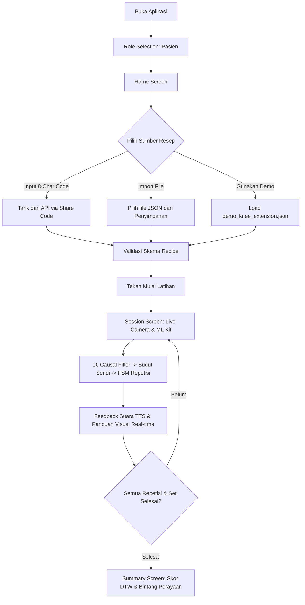
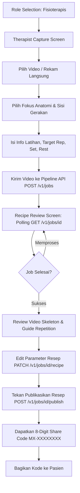

# Motorix PhysioAI — Phase 2 Flutter Application Documentation

Dokumentasi lengkap untuk menjalankan, mengonfigurasi, dan mengembangkan aplikasi **Motorix Phase 2** (`motorix_phase2`), sebuah aplikasi Flutter multi-platform (Android, iOS, Web, macOS) yang menyediakan runtime biomekanik on-device untuk pasien serta portal capture & peninjauan resep latihan fisioterapi.

---

## Daftar Isi

1. [Ringkasan Proyek](#1-ringkasan-proyek)
2. [Prasyarat Sistem](#2-prasyarat-sistem)
3. [Panduan Menjalankan Aplikasi (Quick Start)](#3-panduan-menjalankan-aplikasi-quick-start)
4. [Konfigurasi Server API Backend](#4-konfigurasi-server-api-backend)
5. [Panduan Menjalankan Backend Pipeline API (Lokal)](#5-panduan-menjalankan-backend-pipeline-api-lokal)
6. [Struktur Proyek & Arsitektur](#6-struktur-proyek--arsitektur)
7. [Alur Kerja Pengguna (User Workflows)](#7-alur-kerja-pengguna-user-workflows)
   - [Peran 1: Pasien (Patient Mode)](#peran-1-pasien-patient-mode)
   - [Peran 2: Fisioterapis (Physiotherapist Mode)](#peran-2-fisioterapis-physiotherapist-mode)
8. [Spesifikasi Teknis Engine Biomekanik](#8-spesifikasi-teknis-engine-biomekanik)
9. [Referensi Endpoint REST API](#9-referensi-endpoint-rest-api)
10. [Pengujian dan Build Produksi](#10-pengujian-dan-build-produksi)
11. [Troubleshooting & FAQ](#11-troubleshooting--faq)

---

## 1. Ringkasan Proyek

Motorix Phase 2 adalah komponen runtime pasien dan fisioterapis yang beroperasi secara hibrida:
- **Pasien**: Menjalankan deteksi pose tubuh (Google ML Kit Pose Detection 33 landmarks), filter getaran One Euro (1€), Finite State Machine (FSM) repetisi gerakan, umpan balik suara (TTS), serta penilaian skor Dynamic Time Warping (DTW) secara **100% offline on-device** tanpa memerlukan koneksi internet aktif selama latihan.
- **Fisioterapis**: Merekam demonstrasi klinis atau memilih file video, menentukan fokus anatomis tubuh (lutut, bahu, lengan, tangan, jari, dll.), mengunggah ke backend Pipeline API, meninjau hasil ekstraksi video skeleton overlay & repetition guide, menyesuaikan parameter resep (target rep, set, rest, rentang sudut aman), lalu memublikasikan resep untuk menghasilkan **8-karakter Share Code** (contoh: `MX-E44D3752`) yang dapat langsung dimasukkan oleh pasien.

---

## 2. Prasyarat Sistem

Sebelum menjalankan aplikasi, pastikan sistem Anda memenuhi persyaratan berikut:

| Komponen | Versi Minimal / Rekomendasi | Catatan |
|---|---|---|
| **Flutter SDK** | `^3.3.0` hingga `<4.0.0` (Dart 3.x) | Cek dengan `flutter --version` |
| **Android Studio / SDK** | SDK Platform API 24+ (Android 7.0+) | Diperlukan untuk Google ML Kit Native |
| **Xcode** (macOS) | Xcode 15+ & CocoaPods | Diperlukan jika menjalankan target iOS / macOS |
| **Web Browser** | Google Chrome / Chromium / Safari | Untuk pengujian antarmuka Web |
| **Python** (Opsional) | Python 3.10+ & `ffmpeg` | Diperlukan jika ingin menjalankan backend lokal |

---

## 3. Panduan Menjalankan Aplikasi (Quick Start)

### Langkah 1: Masuk ke Direktori Proyek

Buka terminal dan arahkan ke folder `phase2_flutter`:

```bash
cd apps/phase2_flutter
```

### Langkah 2: Unduh Dependensi Flutter

```bash
flutter pub get
```

### Langkah 3: Verifikasi Status & Analisis Kode

```bash
flutter analyze
flutter test
```

### Langkah 4: Jalankan Aplikasi

#### Opsi A: Menjalankan dengan Server Cloud Run (Default)

Secara default, aplikasi langsung terhubung ke backend Cloud Run resmi Motorix:

```bash
# Menjalankan di perangkat/emulator default
flutter run

# Menjalankan di Google Chrome (Web)
flutter run -d chrome

# Menjalankan di macOS Desktop
flutter run -d macos

# Menjalankan di emulator/device Android tertentu
flutter devices
flutter run -d <DEVICE_ID>
```

#### Opsi B: Menjalankan Terhubung ke Backend Lokal

Gunakan parameter `--dart-define` saat menjalankan Flutter untuk mengarahkan baseUrl API:

```bash
# 1. Menghubungkan ke server lokal (iOS Simulator, macOS Desktop, Web)
flutter run --dart-define=PIPELINE_API_BASE_URL=http://127.0.0.1:8000

# 2. Menghubungkan dari Android Emulator ke host machine
flutter run --dart-define=PIPELINE_API_BASE_URL=http://10.0.2.2:8000

# 3. Menghubungkan dari Perangkat Fisik (via Wi-Fi LAN yang sama)
flutter run --dart-define=PIPELINE_API_BASE_URL=http://192.168.1.X:8000
```

---

## 4. Konfigurasi Server API Backend

Aplikasi dilengkapi mekanisme penggantian URL backend secara dinamis baik saat build maupun saat runtime:

### 1. Pengaturan Default Preset ([api_config.dart](file:///Users/willson/motorix/apps/phase2_flutter/lib/app/api_config.dart))

- **Google Cloud Run (Live)**: `https://motorix-pipeline-api-1031020302062.asia-southeast1.run.app`
- **Localhost (Desktop/iOS/Web)**: `http://127.0.0.1:8000`
- **Android Emulator**: `http://10.0.2.2:8000`

### 2. Penggantian URL Melalui UI (In-App)

Di dalam aplikasi, pengguna fisioterapis atau penguji dapat membuka sheet pengaturan server melalui tombol **"Pengaturan Server API"** yang terdapat pada:
1. Header halaman Beranda Pasien ([home_screen.dart](file:///Users/willson/motorix/apps/phase2_flutter/lib/app/home_screen.dart)).
2. Halaman Rekam Demonstrasi Fisioterapis ([therapist_capture_screen.dart](file:///Users/willson/motorix/apps/phase2_flutter/lib/app/therapist/therapist_capture_screen.dart)).

Pengguna dapat memilih salah satu preset atau mengetikkan URL kustom, lalu menekan **"Uji Koneksi & Kesehatan Server"** untuk memeriksa respon `/health`.

---

## 5. Panduan Menjalankan Backend Pipeline API (Lokal)

Jika Anda ingin memproses video demonstrasi di komputer Anda sendiri secara offline tanpa internet:

#### Menggunakan `uv` (Direkomendasikan):

```bash
# 1. Pindah ke direktori backend API
cd services/pipeline_api

# 2. Buat virtual environment dengan Python 3.11 & pasang dependensi
uv venv --python 3.11 .venv --clear
source .venv/bin/activate
uv pip install -r requirements.txt

# 3. Pastikan ffmpeg terpasang di sistem (contoh macOS: brew install ffmpeg)
ffmpeg -version

# 4. Unduh model MediaPipe ke folder lokal (hanya butuh sekali di awal)
python -m app.download_models

# 5. Jalankan server FastAPI
uvicorn app.main:app --reload --host 0.0.0.0 --port 8000
```

Setelah server aktif, dokumentasi interaktif Swagger UI dapat dibuka di:
`http://localhost:8000/docs`

---

## 6. Struktur Proyek & Arsitektur

```text
apps/phase2_flutter/
├── assets/
│   ├── images/               # Aset ilustrasi UI, logo, badge, celebration
│   ├── models/               # Model MediaPipe task offline (pose_lite, hand)
│   └── recipes/              # Resep demo bawaan (demo_knee_extension.json)
├── lib/
│   ├── app/                  # Lapisan Antarmuka & State Aplikasi
│   │   ├── therapist/        # Modul Fisioterapis
│   │   │   ├── pipeline_client.dart         # Klien HTTP REST API
│   │   │   ├── therapist_capture_screen.dart# Form input, perekam video & fokus anatomi
│   │   │   ├── recipe_review_screen.dart    # Polling job, video preview & edit resep
│   │   │   └── video_recorder_screen.dart   # Perekam kamera video fisioterapis
│   │   ├── api_config.dart                  # Manajemen endpoint API dinamis
│   │   ├── home_screen.dart                 # Beranda pasien, input share code & demo
│   │   ├── listtask_screen.dart             # Daftar tugas latihan terjadwal
│   │   ├── mlkit_camera_source_native.dart  # Stream frame kamera Android/iOS ke ML Kit
│   │   ├── motorix_app.dart                 # Root MaterialApp, navigasi & tema
│   │   ├── onboarding_screen.dart           # Layar onboarding pengenalan fitur
│   │   ├── pose_painter.dart                # Canvas visualisasi skeleton & landmark
│   │   ├── recipe_repository.dart           # Pemuatan resep (demo, file JSON, API code)
│   │   ├── role_selection_screen.dart       # Pemilihan peran (Pasien vs Fisioterapis)
│   │   ├── server_selector_sheet.dart       # Modal konfigurasi server API
│   │   ├── session_screen.dart              # Runtime latihan real-time & feedback
│   │   ├── splash_screen.dart               # Layar pembuka / splash screen
│   │   ├── summary_screen.dart              # Ringkasan hasil latihan & perayaan skor
│   │   └── web_camera_pose_source.dart      # Fallback kamera untuk Web
│   ├── src/                  # Core Engine Biomekanik & Perhitungan Matematika
│   │   ├── engine.dart       # ExerciseEngine (FSM, phase tracker, repetisi, scoring)
│   │   ├── features.dart     # Ekstraksi sudut sendi & jarak dari 33 landmark
│   │   ├── filter.dart       # One Euro Filter (1€ Filter) peredam jitter
│   │   ├── recipe.dart       # Model data & validator ExerciseRecipe JSON
│   │   ├── scoring.dart      # Dynamic Time Warping (DTW) & form similarity
│   │   └── types.dart        # Tipe data pose, sudut, frame, dan status
│   ├── main.dart             # Entrypoint Flutter
│   └── motorix_phase2.dart   # Barrel export library
├── test/                     # Unit test & Widget test
│   ├── pipeline_client_test.dart
│   ├── recipe_repository_test.dart
│   ├── runtime_test.dart
│   └── session_screen_test.dart
├── pubspec.yaml              # Konfigurasi dependensi Flutter
└── documentation.md          # Dokumentasi teknis ini
```

---

## 7. Alur Kerja Pengguna (User Workflows)

### Peran 1: Pasien (Patient Mode)



1. **Pemilihan Resep**: Pasien dapat memasukkan 8-digit kode latihan (contoh: `MX-E44D3752`), mengimpor file `recipe.json`, atau langsung menggunakan resep demo ekstensi lutut.
2. **Setup Kamera**: Pasien meletakkan ponsel dengan jarak 1.5–2.5 meter hingga seluruh sendi target berada dalam bingkai panduan visual.
3. **Pelaksanaan Sesi**:
   - Engine melacak sudut gerakan secara real-time.
   - Suara instruktur (Text-to-Speech) memberikan panduan koreksi posisi jika gerakan terlalu cepat, sudut belum tuntas, atau terjadi kompensasi tubuh.
   - Repetisi otomatis bertambah saat fase kembali ke posisi awal terpenuhi (`return_complete`).
4. **Ringkasan & Skor**: Menampilkan akurasi bentuk gerak (skor 0–100%), repetisi yang berhasil, durasi latihan, dan animasi perayaan.

---

### Peran 2: Fisioterapis (Physiotherapist Mode)



1. **Input Demonstrasi**: Dokter merekam 4–6 repetisi gerakan standar klinis.
2. **Pemilihan Fokus Anatomi**:
   - *Otomatis*, *Seluruh Tubuh*, *Kepala & Leher*, *Bahu*, *Lengan & Siku*, *Tangan*, *Jari-jari*, *Badan*, *Panggul & Paha*, *Lutut*, *Kaki*, *Seluruh Tungkai*.
   - Sisi: *Otomatis*, *Kanan*, *Kiri*, *Bilateral*.
3. **Ekstraksi Pipeline**: Server memproses video dengan MediaPipe Tasks Pose & Hand Landmarker, mendeteksi segmen repetisi terbersih, dan mengekstraksi kurva template referensi.
4. **Review & Tinjauan**: Dokter dapat memutar video overlay skeleton untuk memverifikasi keakuratan deteksi.
5. **Publikasi**: Setelah disetujui, resep dikunci statusnya menjadi `published` dan menghasilkan share code unik.

---

## 8. Spesifikasi Teknis Engine Biomekanik

Engine berada di dalam namespace `motorix_phase2` ([engine.dart](file:///Users/willson/motorix/apps/phase2_flutter/lib/src/engine.dart)):

### 1. One Euro Filter (`OneEuroFilter`)
- Meredam getaran (*jitter*) koordinat landmark video kamera tanpa menimbulkan delay visual.
- Parameter adaptif: `minCutoff = 1.0 Hz`, `beta = 0.007`, `dCutoff = 1.0 Hz`.

### 2. State Machine Repetisi (`ExercisePhase`)
- `rest` / `ready`: Pengguna bersiap dalam toleransi posisi awal.
- `movement_start`: Pengguna mulai bergerak menuju sudut puncak.
- `turning_point`: Pengguna mencapai rentang gerak maksimal (ROM).
- `hold`: Mempertahankan posisi puncak sesuai target durasi dokter.
- `return_start`: Pengguna bergerak kembali ke posisi awal.
- `return_complete`: Repetisi tervalidasi dan dihitung (+1).

### 3. Penilaian Skor DTW (`FastDTW`)
- Menghitung jarak deviasi bentuk kurva trajektori sudut gerakan pasien terhadap kurva template dokter.
- Skor dinormalisasi ke skala 0–100%:
  $$\text{Score} = \max\left(0, 100 - \frac{\text{DTW Distance}}{\text{Length} \times \text{Tolerance}}\right)$$

---

## 9. Referensi Endpoint REST API

| Method | Path | Deskripsi |
|---|---|---|
| `GET` | `/health` | Mengecek kesiapan engine MediaPipe & FFmpeg |
| `POST` | `/v1/jobs` | Mengunggah video demonstrasi dan metadata latihan |
| `GET` | `/v1/jobs/{id}` | Mengambil status job (queued, extracting, ready, failed) |
| `GET` | `/v1/jobs/{id}/preview` | Mengalirkan video MP4 dengan skeleton overlay |
| `GET` | `/v1/jobs/{id}/guide` | Mengalirkan video repetisi panduan klinis |
| `GET` | `/v1/jobs/{id}/recipe` | Mengambil draf JSON ExerciseRecipe |
| `PATCH`| `/v1/jobs/{id}/recipe` | Memodifikasi parameter resep (sets, reps, audio) |
| `POST` | `/v1/jobs/{id}/publish`| Memublikasikan resep & menghasilkan kode share |
| `GET` | `/v1/recipes/code/{code}` | Mengambil resep aktif pasien berdasarkan kode share |

---

## 10. Pengujian dan Build Produksi

### Menjalankan Unit Test

```bash
cd apps/phase2_flutter
flutter test
```

### Build APK Android (Release / Debug)

```bash
# Debug APK
flutter build apk --debug

# Release APK (Production)
flutter build apk --release --dart-define=PIPELINE_API_BASE_URL=https://motorix-pipeline-api-1031020302062.asia-southeast1.run.app
```

### Build iOS Archive

```bash
flutter build ipa --release
```

### Build Web Bundle

```bash
flutter build web --release
```

---

## 11. Troubleshooting & FAQ

### Q1: Kamera tidak muncul di Android Emulator?
> **Solusi**: Buka menu pengaturan Android Virtual Device (AVD) di Android Studio: `Settings` $\rightarrow$ `Camera` $\rightarrow$ set `Front Camera` ke `Webcam0` agar kamera laptop Anda tersambung ke emulator.

### Q2: Error koneksi `SocketException: Connection refused` pada `127.0.0.1` di Android?
> **Solusi**: Di Android Emulator, `127.0.0.1` merujuk ke internal emulator sendiri. Gunakan IP host `http://10.0.2.2:8000` atau pilih preset **Android Emulator** pada sheet pengaturan server.

### Q3: Error Cleartext HTTP traffic not permitted di Android?
> **Solusi**: File `AndroidManifest.xml` pada modul debug telah dikonfigurasi dengan `android:usesCleartextTraffic="true"`. Pastikan endpoint API lokal Anda menggunakan HTTP pada port yang benar.

### Q4: Apakah sesi latihan pasien membutuhkan kuota internet?
> **Solusi**: **Tidak.** Koneksi internet hanya dibutuhkan saat pertama kali memasukkan Share Code untuk mendownload resep JSON (~15 KB). Selama latihan berlangsung, seluruh kalkulasi sudut sendi, FSM, audio, dan scoring berjalan 100% lokal on-device.
